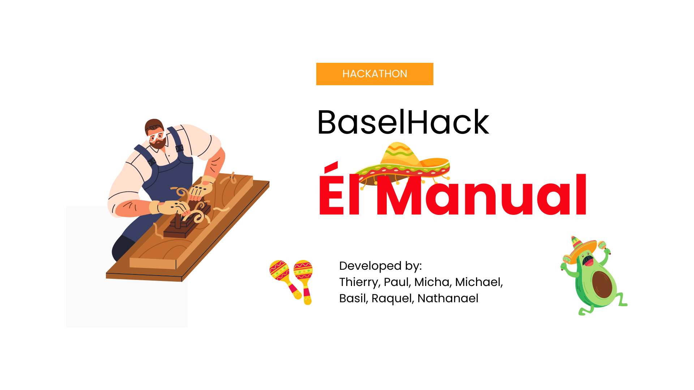

# BaselHack 2024

This is the template repository, which makes our lives (and especially the lives of the jury) easier,
if you follow our structure.

## Explanation

Please make sure that everything, that is code related, goes into `code` directory.

If you have documentation about the code (e.g. UML Diagrams, a readme etc.), that should go into the `documentation` directory.

If you have assets (like videos, presentations etc.), this can go into the `assets` directory.

You can use the MIT license in this template. Make sure to adjust the copy right holders in the placeholder `<copyright holder>` and add every team member to it.
You are also free to choose any other license - depending on the consensus of your team.

Thanks a lot!
